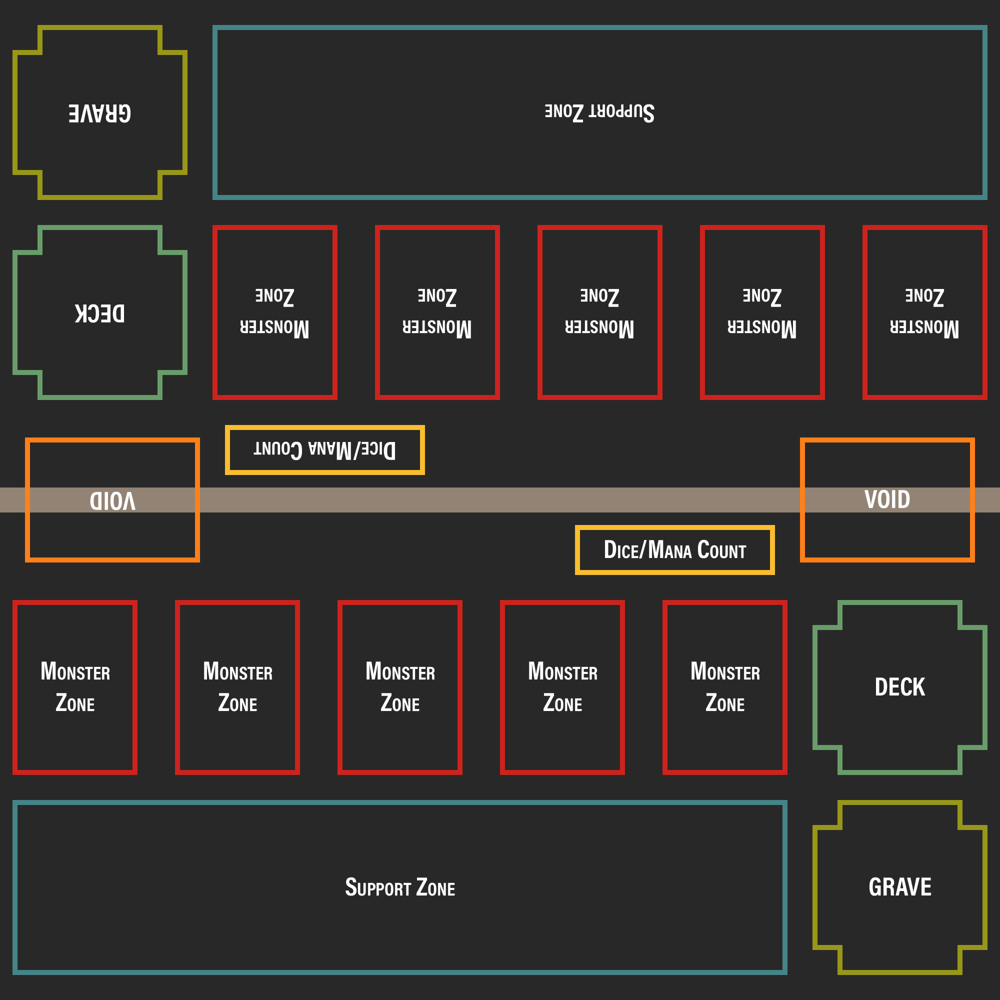

# Components
---
## Field (Play area)
- [Monster Zones](#mzones)
- [Support Zone](#szone)
- [Deck](#deck)
- [Grave](#grave)
- [Void](#mvoid)

Each player will have these zones:

## Monster Zones
### Gameplay Purpose:
These are where 1 of the 2 types of card can be placed, 'Monster Cards'. These cards have the ability to do attack other monsters or the player directly if possible. The have an SP (Strength Points) value, can be 'Summoned' (placed on the field) by paying RP (Resource Points). Upon defeat by other monsters, destruction from card effects or being sacrificed for other summons/effects, they go to the Grave zone by default but can be sent to the Void or returned to the hand/deck if a card specifies.
### Implementation:
An array storing 5 'monsterZone' objects would be a good way to store it. Each 'monsterZone' object would have it's own methods and variables but some cards may interact with all monsters on a players field so grouping them together may help to address this.
### Methods & Functions (Encapsulating Object):
##### DestroyAll()
Calls the destroy() method on each of the monsterZone objects. 'card' objects that are immune to destruction are dealt with within this destroy() method.
### Implementation (monsterZone object):
Each monsterZone should contain the following values:
- int zoneID = stores the number of the zone (from left)
- bool isOccupied = determines if the zone is able to be assigned a card obj. A zone may be locked off by a card effect to it is treated as occupied
- cardObj currentCard = a card object that stores the currently assigned card
### Methods & Functions (monsterZone object):
##### destroy()
- Destroys the current card by removing the cardObj stored and sending it to the Grave obj
##### destroyAndVoid()
- Same as destroy() but adds destroyed card to theVoid array rather than the grave
##### bounce()
- Remove the cardObj and add it to the player's hand array. does not 'destroy' the card in game mechanics but does remove the cardObj.
##### modifySP(int sp)
- Adds the value of sp to the SP value of the cardObj stored. Adding a negative value will reduce the SP!
##### counterEffect()
- Sets a flag on the cardObj that it's effect cannot be used ('countered' is a game keyword).
### <a id="szone">Support Zone
---
## <a id="deck">Deck
### Gameplay Purpose:
The deck stores the players cards that they will use in that game. They draw cards at the start of the turn and can sometimes draw additional cards during the course of the game or search the entire deck for a card with specific criteria. Cards may also be returned to the deck also. If a player runs out of cards in the deck they cannot draw at the start of their turn. The deck size is between 45-60 cards, with a maximum of 3 copies of each card allowed.
Decks are private knowledge and can't be looked at by either player unless stated by a card effect.
### Implementation
The deck object should contain an array of 'card' objects in order of the last shuffle. This is so cards may reveal a certain number of cards from the top/bottom, put cards at the top/bottom in any order due to their effect. Variables should include a 'deck size' that stores the original number of cards in the deck, a 'current deck size' for how many cards are left and an 'is empty' variable for if the deck is empty.
### Methods & Functions
##### draw(int amount)
- Add the top X number of card(s) (first value in the 'cards' array) to the players hand.\
- amount = int that determines how many card objects are accessed from the start of the 'cards' array
##### revealTop(int amount)
- Access the top X number of card(s) and display them to both players.\
amount = int that determines how many card objects are accessed from the start of the 'cards' array
##### revealBottom(int amount)
- Same as revealTop() but from the bottom of the array
##### searchFilter(str cardName, str[] alignments, int SP, int RP, int fastRP)
- Generate a new 'card' array with 'card' objects that match specified parameters. Params are all optional, if none are provided on call it should return the original array. If the new array is empty, should return an error for now (Fail-to-find game mechanic can be added later)
##### addToHand(cardObj card)
- Adds a specified card to the player's hand given it's object ID. Removes it from the card array in deck and adds to the players hand array.
##### mill(cardObj card)
- Same as addToHand() but instead sends it to the Grave. Instead of adding to hand array, add it to player's grave array.
##### theVoid(cardObj card)
- Same as addToHand() & mill() but adds to theVoid array instead.
##### shuffle()
- Randomises the order of the array.
## <a id="grave">Grave
---
### Gameplay Purpose:
This is the 'used' pile of the game. Cards that are destroyed, sacrificed, discarded etc. are sent here by default. Each player's grave is public knowledge, both players may look at eachothers grave at any time. Monsters can be 'revived' from the grave using card effects.
### Implementation:
Similar to the Deck obj, it consists of a card object array. 
### Methods & Functions:
##### view()
- Returns the card obj array.
##### voidCard(cardObj card)
- Deletes card from the array and then adds it to the void array.
##### addToDeck(cardObj card, bool topDeck)
- Deletes card from the array and adds it to the begining of the deck array if topDeck is true or the bottom if false
##### addToHand(cardObj card)
- Deletes the card from the array and adds it to the hand array.
##### revive(cardObj card, bool ownField)
Deletes card from the grave array and calls the summon() method on it.
##### voidAll()
- Calls the voidCard() method on all card objs in the array.  
---  
## <a id="mvoid">Void
---
### Gampeplay Purpose:
### Implementation:
### Methods & Functions:
